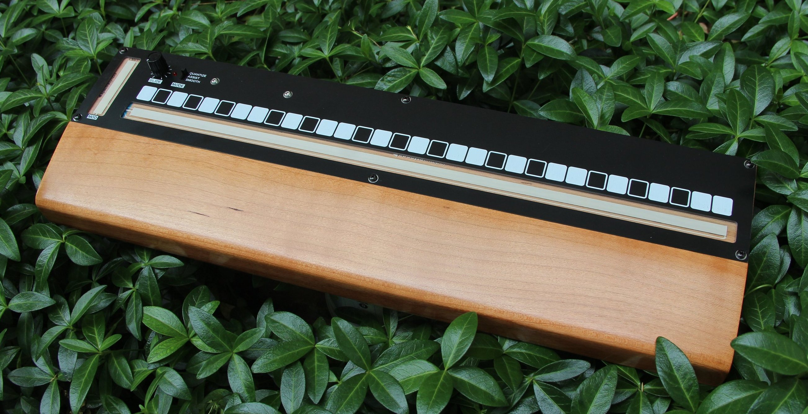

# Rust Language STM32L412 Ribbon Controller

## Features

### Three analog outputs
- `RIBBON CV`: 1volt/per octave scaled control voltage generated by the main ribbon
- `GATE`: 5 volt gate signal which is high when pressing the main ribbon and low otherwise
- `MOD CV`: mod-wheel like control voltage generated by the MOD ribbon, in `[0v, +5v]` 

### MIDI output
- Note on/off based on finger position on the ribbon
- Pitch-bend message bends the pitch when the ribbon is in between notes 
- Mod: mod-wheel message generated by the MOD ribbon

### Three pitch modes are available
1) `QUANTIZE`: notes are forced to be musical half steps, sliding around will zipper to new notes
2) `ASSIST`: when you first press a new note it is forced to be a musical half step, but continued sliding is smooth
3) `SMOOTH`: no quantization is performed, offers the greatest degree of pitch freedom but is difficult to play in tune

### Glide control
- Adds portamento to the `RIBBON CV` signal
- This allows you to smooth out the steps when in `QUANTIZE` mode

### Notes about the MIDI output
- This software assumes that the pitch bend range on the receiving instrument is set to +/- 2 semitones (this is typically the default)
    - If the Assist or Smooth modes seem crazy, make sure that the pitch bend range on your instrument is set to +/- 2 semitones
- The MIDI output signal sends note-on, note-off, and pitch bend messages to generate the smooth ribbon action
    - This works best with a mono instrument, and may act differently depending on the MIDI implementation of the receiving device
    - If the receiving instrument has non-retriggering envelopes, it will smoothly slide as expected
    - If the instrument has retriggering envelopes, each time you slide into a new note the envelopes will be triggered
- The MIDI output starts on a fairly low note
    - It works best if the instrument being controlled can be transposed to different octaves

### Rear panel IO jacks and controls
- Output jacks for analog signals `RIBBON CV`, `MOD CV`, and `GATE`
- Standard `MIDI OUT` 5 pin DIN output jack
- `MIDI CH` channel select rotary switch
    - MIDI output is sent on the channel set here
- `9VDC IN` power supply input jack

## Calibration
- A trim potentiometer is exposed through a small hole so the device may be calibrated without disassembly
- Measure the `RIBBON CV` signal with a multimeter
- Set the `MODE` switch to `QUANTIZE`
- Adjust the trim potentiometer while playing alternating octaves so that the octaves are as close to 1.000v apart as you can get
- The `MOD CV` and MIDI output do not require calibration

## Power supply
- A common guitar-pedal style center-negative 9 volt DC wall wart powers the device
- The circuit consumes approximately 20mA from the 9 volt DC power supply

## Project status
- A prototype has been built and tested
- A handmade wooden body houses the components and provides a comfortable wrist rest while playing

## Project goals
- Mostly just for fun and to explore embedded Rust
- Serve as a test bed for the [Josh Ox Ribbon Synth](https://github.com/JordanAceto/josh_Ox_ribbon_synth)
- Build a cute little CV and MIDI source
