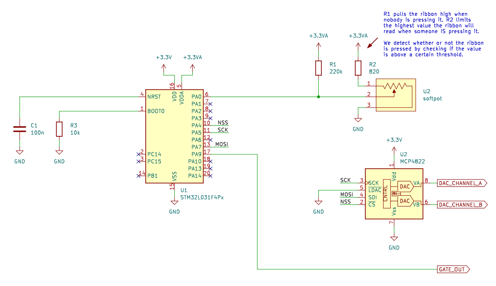

# Basic STM32L031 Ribbon Controller

- Written in Rust
- Mostly just for fun/exploring embedded Rust
- Also to test out ideas for eventually incorporating a digital ribbon controller into the [Josh Ox Ribbon Synth](https://github.com/JordanAceto/josh_Ox_ribbon_synth)

## Simplified Schematic:

