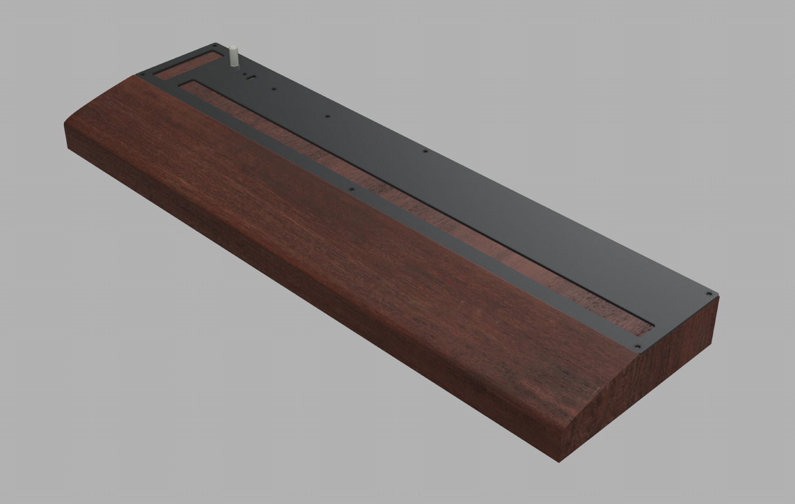
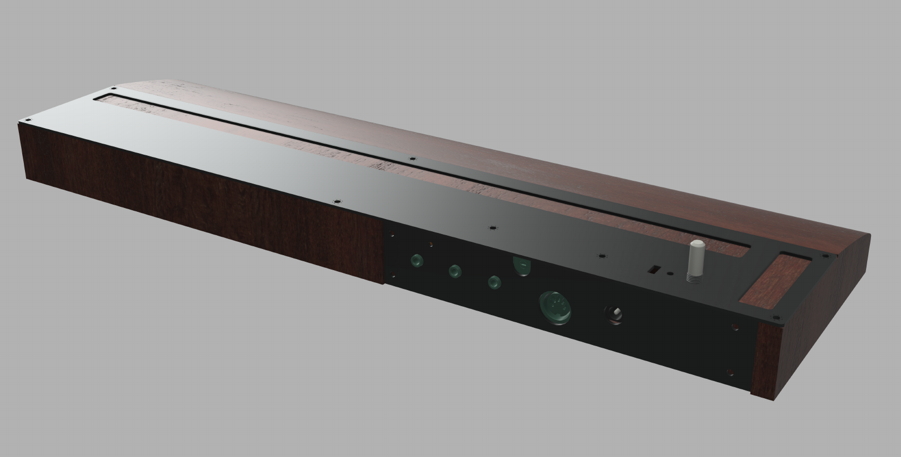
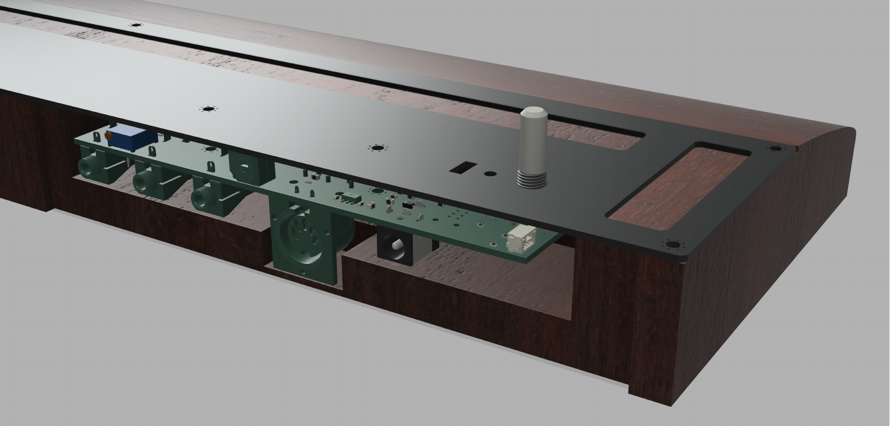
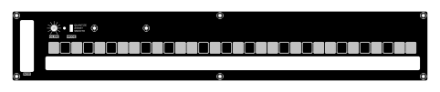

# Rust Language STM32L412 Ribbon Controller

## Three analog outputs
- Ribbon: 1volt/per octave scaled control voltage generated by the main ribbon
- Gate: 5 volt gate signal which is high when pressing the main ribbon and low otherwise
- Mod: mod-wheel like control voltage generated by the MOD ribbon, in `[0v, +5v]` 

## MIDI output
- Note on/off based on finger position on the ribbon
- Pitch-bend message bends the pitch when the ribbon is in between notes 
- Mod: mod-wheel message generated by the MOD ribbon

## Project goals
- Mostly just for fun and to explore embedded Rust
- Serve as a test bed for the [Josh Ox Ribbon Synth](https://github.com/JordanAceto/josh_Ox_ribbon_synth)
- Build a cute little CV and MIDI source

## Simplified signal flow
- Finger position along the ribbon is digitized by the onboard `ADC`
- This position is fed into the `ribbon_controller` software module which conditions the signal and extracts a note on/off gate information
- The smooth output of the `ribbon_controller` is fed into a quantizer to force it to discrete musical half steps, depending on the pitch mode
- MIDI data is sent as note on/off and pitch bend messages
- Analog pitch, mod, and gate signals are sent via the DAC and GPIO pins

## Three pitch modes are available
1) Hard quantize mode: notes are forced to be musical half steps, sliding around will zipper to new notes
2) Assist mode: when you first press a new note it is forced to be a musical half step, but continued sliding is smooth
3) Smooth mode: no quantization is performed, offers the greatest degree of pitch freedom but is difficult to play in tune

## Important note for the MIDI output
- This software assumes that the pitch bend range on the recieving instrument is set to +/- 2 semitones (this is typically the default)
- If the Assist or Smooth modes seem crazy, make sure that the pitch bend range on your instrument is set correctly

## Project status
- Boards for the main pcb and faceplate have been manufactured and tested
- The jack panel has been designed but not yet fabricated
- A wooden housing is planned but not fabricated

## Plan for wooden housing

### A wooden body is planned to proivide structure and a comfortable wrist rest. The proposed plan is rendered below.

- The main longer ribbon runs horizontally. The shorter MOD ribbon is vertically oriented on the left where a mod-wheel would typically be on a keyboard controller.
- The entire wooden body is about 18" long by 5.5" deep by 1.45" tall.
- The builder is free to modify the dimensions or materials to suit their needs.

### Rear view showing connectors, MIDI channel select switch, and exposed trimpot for 1volt/octave calibration.

### Detailed view of circuitboard mounting. 
- The main PCB mounts to the front panel via the glide potentiometer as well as two 10mm long M3 hex standoffs.
- The main PCB is also affixed to the jack panel via the 3.5mm Eurorack compatible jacks.
- The front panel and jack panel are affixed to the wooden body with small wood screws.

### Not shown in the above renders is the front panel and jack plate silkscreens

Front panel silkscreen has piano style keyboard layout to assist the user in hitting desired notes.

Jack plate silkscreen has labels for the various jacks and switches.

