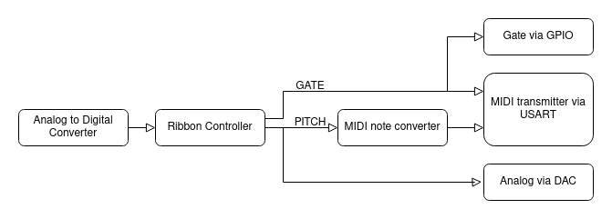

# Basic STM32L031 Ribbon Controller

- Written in Rust
- Mostly just for fun/exploring embedded Rust
- Also to test out ideas for eventually incorporating a digital ribbon controller into the [Josh Ox Ribbon Synth](https://github.com/JordanAceto/josh_Ox_ribbon_synth)

## Simplified signal flow
- Finger position along the ribbon is digitized by the onboard `ADC`
- This position is fed into the `ribbon_controller` software module which conditions the signal and extracts a note on/off gate information
- The smooth output of the `ribbon_controller` is fed into the `midi_note_converter` module which extracts MIDI note and pitch bend information
- MIDI data is sent as note on/off and pitch bend messages
- Analog pitch and gate signals are sent via the DAC and GPIO pin

## Three pitch modes are available for the MIDI output
1) Hard quantize mode: notes are forced to be musical half steps, sliding around will zipper to new notes
2) Assist mode: when you first press a new note it is forced to be a musical half step, but continued sliding is smooth
3) Smooth mode: no quantization is performed, offers the greatest degree of pitch freedom but is difficult to play in tune

## Simplified Schematic

## Important note for the MIDI output
- This software assumes that the pitch bend range on the recieving instrument is set to +/- 2 semitones (this is typically the default)
- If the Assist or Smooth modes seem crazy, make sure that the pitch bend range on your instrument is set correctly
